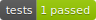
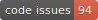

<a href="/resources/img/light_openMINDS-MATLAB-logo.png">
  <picture>
    <source media="(prefers-color-scheme: dark)" srcset="/resources/img/dark_openMINDS-MATLAB-logo.png">
    <source media="(prefers-color-scheme: light)" srcset="/resources/img/light_openMINDS-MATLAB-logo.png">
    
  </picture>
</a>

# openMINDS-MATLAB-UI

<h4 align="center">
  <a href="https://github.com/ehennestad/openMINDS-MATLAB-UI/releases/latest">
    
  </a>
  <a href="https://matlab.mathworks.com/open/github/v1?repo=ehennestad/openMINDS-MATLAB-UI&file=code/gettingStarted.mlx">
    
  </a>
  <a href="https://codecov.io/gh/ehennestad/openMINDS-MATLAB-UI" > 
    
  </a>
  <a href="https://github.com/ehennestad/openMINDS-MATLAB-UI/actions/workflows/update.yml">
   
  </a>
  <a href="https://github.com/ehennestad/openMINDS-MATLAB-UI/security/code-scanning">
   
  </a>
  <a href="https://github.com/ehennestad/openMINDS-MATLAB-UI/actions/workflows/run_codespell.yml?query=event%3Apush+branch%3Amain">
   
  </a>
</h4>

<p align="center">
  <a href="#installation">Installation</a> •
  <a href="#getting-started">Getting Started</a> •
  <a href="#tutorials">Tutorials</a> •
  <a href="#contributing">Contributing</a> •
  <a href="#acknowledgements">Acknowledgements</a>
</p>

---

A MATLAB graphical user interface (GUI) for openMINDS. This toolbox builds upon the [openMINDS_MATLAB](https://github.com/openMetadataInitiative/openMINDS_MATLAB) toolkit, offering interactive forms to streamline metadata entry."

## Requirements:
MATLAB 2023a or later

## Installation
1. Clone or download this repository
2. Navigate to the repository folder in MATLAB
3. Run `setup.m`

## Getting started
This is a very minimal example on how to try out this toolbox. More examples and interactive workflows will be added later.
```
% Create a filepath to a file for saving metadata
filePath = fullfile(userpath, "openMINDS_MATLAB", "demo", "datasetversion_gui.jsonld");

if ~isfile(filePath)
    dsv = openminds.core.DatasetVersion();
    collection = openminds.Collection();
    collection.save(filePath)
    mode = "create";
else
    collection = openminds.Collection(filePath);
    dsv = collection.list("DatasetVersion");
    mode = "modify";
end

dsv = om.uiCreateNewInstance(dsv, collection, "Mode", mode);

if ~isempty(dsv)
    collection.save(filePath)
end
```

## Tutorials
Todo

## Contributing
Todo

## Acknowledgements
Todo


